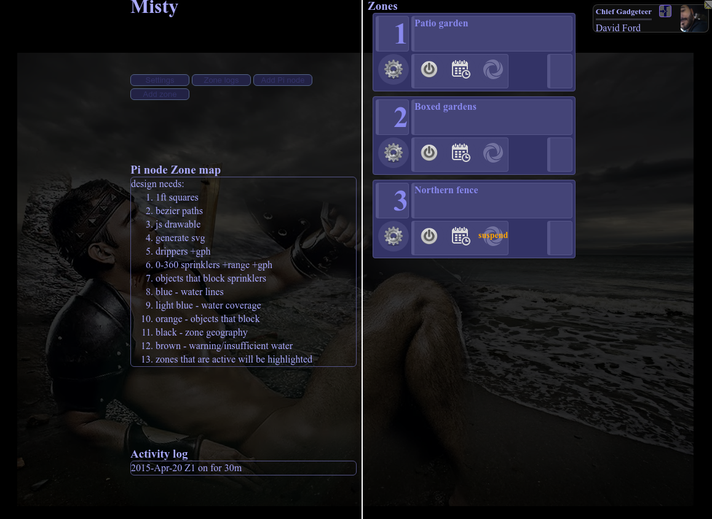

# Misty

Misty is a multiple-node control software for Raspberry Pi using Linux and
Crossbar.io's WAMP router and python-autobahn. You can run the web user
interface on a Pi itself, or any webserver accessible to the Pi. Data is
stored in LDAP which you can also run on a Pi. Current design is limited to
one Pi due to the web UI only (being rewritten now). Using the WAMP
technology, any number of browsers can be logged into and all sessions will
see the same current state of the relay boards controlled by the zone
buttons.

I currently use three Pi nodes as three individual setups. The software has
been rewritten to support multiple nodes and I'm currently modifying the web
UI so all three Pi nodes will be controllable by the same interface. One
controls all the electrical outlets for my saltwater reef tank. Another
controls low volume irrigation watering for our back yard gardens. Another
controls the sprinkler zones for the lawn.

My Pi nodes are built using Arch Linux, some are wired, some are wireless.

## Features
* Based on Python 3, provider uses asyncio
* Crossbar components:
  * dynamic authentication
  * dynamic authorizer
* Authenticates users via LDAP account data
* Stores all zone information in LDAP
* Provider runs WAMP thread as background thread, secondary to main process
* Web UI currently designed for single Pi node but back end supports
  multiple. Updates to web UI in process
* Manual start/stop of a zone plus calendar schedule
* Suspend and unsuspend of a zone
* All activities require authenticated login

## To-Do

* zone map is applicable per zone, it should redraw depending on which zone
  the user is currently working with (mouse over? clickable? zone choice by
  tab?)
* put zone type image behind zone id
* need zone type indicated somewhere (control or sensor)
* pipe wrench - this editable area is for annotating information about the
  zone such as the zone map; drawing dripper locations and their GPH
* calendar - modify/view zone run times in a calendar view
* where to email alerts and reports
* for zone activity, time+duration, show estimated GPH per zone over time
* sensors; moisture, rainfall, internet:rainfall, light, water level
* icons for the zone type; sprinkler, valve, water pump, lights, etc
* build js based SVG editor to draw zones
* nudge app.calendar() to become aware of the UI events for *manual* and
  *suspend* if a time frame is specified. subsequently, add an RPC to fetch
  calendar events so the web UI can show them accordingly on the applicable
  zone
* add user authorization (done) to make each pi node have a *manager-user*
  attribute and a *viewer-user* attribute (done) so *pi nodes* can be configured
  to only be manageable by certain users (future), and read-only viewable by certain
  users. in the absence of these attributes, the *pi node* will be
  manageable by all users.
* increase granularity of user authorization to make each zone per-user
  manageable. in the absence of listed users, the zone is manageable by
  all users permitted to manage the given *pi node*


## Definitions and defaults
| Term | Definition |
|------|------------|
| app dir | /etc/nginx/sites/somehostname.com/app/ |
| AIO | Analog IO |
| DIO | Digital IO |
| pi node | a unique textual reference you assign per Raspberry Pi |
| zone | a single IO unit, such as a GPIO pin that drives a relay |
| router | a WAMP router, the Crossbar.IO is used in this project |
| realm | logical name all logins, callbacks, and RPCs are operate under |

All examples in this project will use the hostname *misty.blue-labs.org* and
the realm *misty*. My web content is all served via nginx and I'll use the
standard default settings and locations per nginx. Defaults locations as per
the [Crossbar.io](https://crossbar.io) examples are also used as much as possible.
Both the WAMP router and provider are run as user *non-root*. Pick any
unprivileged username you feel like and remember to adjust instructions as
needed.


## Requirements

### Overall requirements
* a WAMP setup, I use the crossbario router and python modules
* a webserver
* an LDAP database
* Python 3 (Crossbar.io only supports 3.3+, I use 3.6)
* one or more RaspberryPI units. even the A models can handle this, I use a pi B, pi2 B+,
and pi3 B+
  * you'll need one or more GPIO driven relay boards. you can use either
    `high` or `low` triggered. Misty has logic to correctly handle both on a
    per-zone basis. This means you can have mixed sets of relay boards on the
    same Pi
  * [future] Analog output
  * [future] Digital or Analog sensors

## Install steps
1. Build an appropriate RaspberryPi server and attach a GPIO controlled
    relay board. At least **provider.py** will be run on it. You can run your
    LDAP and nginx services elsewhere as long as the RaspberryPi can reach it
1. Clone this repo
2. Install/modify an *LDAP* server as applicable
3. Install/modify an *nginx* or web server as applicable, install included
    web content
4. Test the LDAP server and web server
  * if you've configured your LDAP server as needed, you should be able to
    run `ldapsearch -xLLL 'zone=3'` and get results matching the bottom of
    the included **misty.ldif**
5. Install software using distribution tools or python tools. test by attempting
    to run **crossbar start** in the app directory, and **python -u provider.py**
    on your pi. Ensure you have all necessary python modules before
    continuing
6. Stop crossbar and provider
7. Set LDAP passwords for the `apimanager` and your user
8. Start the WAMP router in the app directory, **crossbar start**, and leave
    it running
9. Start the provider, **python -u provider.py** in the same directory as
    provider.conf. Local files are not used so it's not really important
    where it's placed. I happen to use the same (although empty) directory
    structure on my pi as I do my web server so it's easy to rsync files.
    **/etc/nginx/sites/hostname.com/app/**
10. Browse to the website you set up for this. If you didn't modify any of
    the zone entries yet, it would look similar to this after login:



### Python modules

The following requirements will pull in additional packages. The below list
should get everything for you.

*  crossbar
*  watchdog
*  setproctitle
*  treq
*  PyNaCl
*  py-ubjson
*  cbor
*  u-msgpack-python
*  lmdb
*  psutil
*  sdnotify
*  shutilwhich
*  Pygments
*  mistune
*  Jinja2
*  PyTrie
*  autobahn
*  sdnotify

### Arch Linux
When using pacman or pb/pkgbuilder (for AUR), install these
* pb -S python-crossbar python-watchdog python-setproctitle python-pnacl python-u-msgpack python-psutil python-pygments python-mistune python-jinja python-autobahn

Some packages don't [yet] exist in AUR, so pip or easy install these:
* easy_install treq py-ubjson cbor lmdb sdnotify


### LDAP
You'll need to set up an LDAP server (OpenLDAP assumed).  Accomplish the
following steps as applicable.  If you don't have an LDAP server, all steps
are necessary.

1. Install openldap, follow appropriate distribution instructions to have a
running service.
2. Modify your slapd.conf per included file
3. Copy the two schema files into your schema directory
4. Rebuild your inline configuration
  1. systemctl stop slapd
  2. rm -rf /etc/openldap/slapd.d/*
  3. su - ldap -s /bin/bash -c "slaptest -f /etc/openldap/slapd.conf -F
  /etc/openldap/slapd.d/; slapindex"
5. Restart slapd
6. Modify the included ldif file, you probably don't want me as the only
   user -- it's there as an example. A single Pi node and three zones
   have been included as an example as well
6. Create your DIT for Misty using included ldif file. It's already in
   superior order so you can use slapadd or ldapadd
7. Set password(s) as applicable


## Let's Encrypt setup
Obtain and install your SSL certificates normally, after installing, make
sure appropriate daemons/users have access to the files. We're using
extended file attributes instead of file permissions because a lot of web
servers, SQL servers, etc, bitch like cranky fucks if they don't have
exclusive permissions to keys and it's fucking lame to make a copy of keys
for every service that does this.

```
setfacl -m g:ldap:rx /etc/letsencrypt/{live,archive}
setfacl -m g:ldap:r /etc/letsencrypt/archive/misty.blue-labs.org/privkey*.pem

setfacl -m g:non-root:rx /etc/letsencrypt/{live,archive}
setfacl -m g:non-root:r /etc/letsencrypt/archive/misty.blue-labs.org/privkey*.pem
```


## nginx

```
worker_processes  auto;
error_log /var/log/nginx/error.log debug;

events {
    worker_connections  1024;
}

http {
    sendfile on;

    ssl_ciphers                 "ECDHE-ECDSA-AES256-GCM-SHA384:ECDHE-RSA-AES256-GCM-SHA384:ECDHE-ECDSA-AES256-SHA384:ECDHE-RSA-AES256-SHA384:ECDHE-ECDSA-AES128-GCM-SHA256:ECDHE-RSA-AES128-GCM-SHA256:ECDHE-ECDSA-AES128-SHA256:ECDHE-RSA-AES128-SHA256";
    ssl_protocols               TLSv1.2;
    ssl_prefer_server_ciphers   on;
    ssl_session_cache           shared:SSL:10m;
    ssl_session_timeout         5m;
    ssl_session_tickets         off;
    ssl_stapling                on;
    ssl_stapling_verify         on;

    ssl_password_file           /etc/nginx/passphrases;

    resolver 107.170.82.162 valid=300s;
    resolver_timeout 5s;

    add_header Strict-Transport-Security "max-age=31536000; includeSubdomains; preload";
    add_header X-Frame-Options DENY;
    add_header X-Content-Type-Options nosniff;

    upstream websocket {
        server 127.0.0.1:8080;
    }

    map $http_upgrade $connection_upgrade {
        default upgrade;
        '' close;
    }

    server {
        listen 80 default_server;
        return 301 https://$host$request_uri;
    }

    server {
        ssl                     on;
        listen                  443 ssl http2;
        server_name             misty.blue-labs.org;

        ssl_certificate         /etc/letsencrypt/live/misty.blue-labs.org/fullchain.pem;
        ssl_certificate_key     /etc/letsencrypt/live/misty.blue-labs.org/privkey.pem;
        ssl_trusted_certificate /etc/letsencrypt/live/misty.blue-labs.org/fullchain.pem;

        location / {
           root                 sites/misty.blue-labs.org/htdocs/;
           index                index.html;
        }

        location /ws {
            #proxy_set_header        X-Forwarded-For $proxy_add_x_forwarded_for;
            #proxy_set_header        X-Forwarded-Proto $scheme;

            proxy_http_version  1.1;
            proxy_set_header    Host $host:8080;
            proxy_set_header    X-Forwarded-For $remote_addr;
            proxy_set_header    Upgrade $http_upgrade;
            proxy_set_header    Connection $connection_upgrade;
            proxy_pass          https://websocket;
        }
    }
}
```


## Systemd unit files
These files are presented as if both the services will be running on the
RaspberryPi. Adjust as needed if you run the WAMP router somewhere else.

**/etc/systemd/system/misty-crossbar.service**
```
[Unit]
Description=Misty service
After=network.target

[Service]
User=non-root
Environment=PYTHONUNBUFFERED=1
WorkingDirectory=/etc/nginx/sites/misty.blue-labs.org/app/
ExecStart=/usr/bin/crossbar start

[Install]
WantedBy=multi-user.target
```

**/etc/systemd/system/misty-app.service**
```
[Unit]
Description=Misty APP
After=network.target
After=misty-crossbar.service

[Service]
User=non-root
PermissionsStartOnly=true
Environment=PYTHONUNBUFFERED=1
WorkingDirectory=/etc/nginx/sites/misty.blue-labs.org/app/
ExecStartPre=/usr/bin/setfacl -m u:non-root:rw /dev/gpiomem
ExecStart=/usr/bin/python provider.py

[Install]
WantedBy=multi-user.target
```


## Crossbar
### manual start
```
cd $projectdirectory/app/
crossbar start
```

You will see a few dozen lines of output. There should be no errors, no
tracebacks, no indications of exceptions and when idle, the last several lines
should resemble this:
```
2017-03-09T19:08:38-0500 [Controller  24493] Joined realm 'crossbar' on node management router
2017-03-09T19:08:38-0500 [Controller  24493] Starting Router with ID 'worker-001'...
2017-03-09T19:08:38-0500 [Router      24498] Worker process starting (CPython-EPollReactor) ..
2017-03-09T19:08:39-0500 [Controller  24493] Router with ID 'worker-001' and PID 24498 started
2017-03-09T19:08:39-0500 [Router      24498] Realm 'authentication' started
2017-03-09T19:08:39-0500 [Controller  24493] Router 'worker-001': realm 'realm-001' (named 'authentication') started
2017-03-09T19:08:39-0500 [Controller  24493] Router 'worker-001': role 'role-001' (named 'authenticator') started on realm 'realm-001'
2017-03-09T19:08:39-0500 [Router      24498] Realm 'misty' started
2017-03-09T19:08:39-0500 [Controller  24493] Router 'worker-001': realm 'realm-002' (named 'misty') started
2017-03-09T19:08:39-0500 [Controller  24493] Router 'worker-001': role 'role-002' (named 'Provider') started on realm 'realm-002'
2017-03-09T19:08:39-0500 [Controller  24493] Router 'worker-001': role 'role-003' (named 'authorizer') started on realm 'realm-002'
2017-03-09T19:08:39-0500 [Controller  24493] Router 'worker-001': role 'role-004' (named 'Client') started on realm 'realm-002'
2017-03-09T19:08:39-0500 [Router      24498] started component: authenticator.AuthenticatorSession id=1858000276719066
2017-03-09T19:08:39-0500 [Router      24498] WAMP-Ticket dynamic authenticator registered
2017-03-09T19:08:39-0500 [Controller  24493] Router 'worker-001': component 'component-001' started
2017-03-09T19:08:39-0500 [Router      24498] started component: authorizer.AuthorizerSession id=3107983548066556
2017-03-09T19:08:39-0500 [Router      24498] Dynamic authorizer joined: SessionDetails(realm=<misty>, session=3107983548066556, authid=<None>, authrole=<authorizer>, authmethod=None, authprovider=None, authextra=None, resumed=None, resumable=None, resume_token=None)
2017-03-09T19:08:40-0500 [Controller  24493] Router 'worker-001': component 'component-002' started
2017-03-09T19:08:40-0500 [Router      24498] Loaded 253 cookie records from file. Cookie store has 126 entries.
2017-03-09T19:08:40-0500 [Router      24498] File-backed cookie store active /etc/nginx/sites/misty.blue-labs.org/app/.crossbar/cookies.dat
2017-03-09T19:08:40-0500 [Router      24498] Loading server TLS key from /etc/letsencrypt/live/misty.blue-labs.org/privkey.pem
2017-03-09T19:08:40-0500 [Router      24498] Loading server TLS certificate from /etc/letsencrypt/live/misty.blue-labs.org/cert.pem
2017-03-09T19:08:40-0500 [Router      24498] Loading server TLS chain certificate from /etc/letsencrypt/live/misty.blue-labs.org/chain.pem
2017-03-09T19:08:40-0500 [Router      24498] Using explicit TLS ciphers from config
2017-03-09T19:08:40-0500 [Router      24498] OpenSSL is using elliptic curve prime256v1 (NIST P-256)
2017-03-09T19:08:40-0500 [Router      24498] Site (TLS) starting on 8080
2017-03-09T19:08:40-0500 [Controller  24493] Router 'worker-001': transport 'transport-001' started
```


## Provider
The **provider.py** file runs on your raspberrypi machine. **provider.py** and
**provider.conf** should be located in the same directory.
### manual start

```
python -u provider.py
```

If you are using the default included zone definitions, on successful
startup, your screen output resemble this:
```
┌[✓  Tue Feb 28 05:50 non-root@misty  [/etc/nginx/sites/misty.blue-labs.org/app]
└─> python -u provider.py
LDAP init ldap://127.0.0.1:389 - cleartext - user: uid=apimanager,ou=People,ou=misty,dc=blue-labs,dc=org - not lazy - unbound - closed - <no socket> - tls not started - not listening - SyncStrategy - internal decoder
2017-02-28T05:50:24 provider.py:1198: UserWarning: we need a function to reduce something like "1245m" to 20h45m
  warnings.warn('we need a function to reduce something like "1245m" to 20h45m')

2017-02-28T05:50:24 hardware setup: [] set for input
2017-02-28T05:50:24 hardware setup: [4, 17, 18] set for output
ClientSession connected:          Joining realm <misty> with authid <apimanager>
ClientSession challenge received: Challenge(method=ticket, extra={})
ClientSession onJoin:             {} SessionDetails(realm=<misty>, session=8526705521033352, authid=<apimanager>, authrole=<Provider>, authmethod=ticket, authprovider=dynamic, authextra={'roleAdmin': [], 'jpegPhoto': [], 'department': [], 'displayName': []}, resumed=None, resumable=None, resume_token=None)
LDAP init ldap://127.0.0.1:389 - cleartext - user: uid=apimanager,ou=People,ou=misty,dc=blue-labs,dc=org - not lazy - unbound - closed - <no socket> - tls not started - not listening - SyncStrategy - internal decoder
onjoin sublist: {'exact': [3372332874471779], 'prefix': [], 'wildcard': []}
Subscribed 0 procedure(s)
zones.research(caller=8526705521033352)
2017-02-28T05:50:37 hardware setup: [] set for input
2017-02-28T05:50:37 hardware setup: [4, 17, 18] set for output
zone(1/gpio#4) logic level: True, active: FALSE
zone(2/gpio#17) logic level: True, active: FALSE
zone(3/gpio#18) logic level: True, active: FALSE
publishing to org.blue_labs.misty.zones, options={'exclude': None, 'eligible': [8526705521033352], 'acknowledge': True} {1: {'zone': 1, 'pi-node': 'backyard gardens', 'trigger': '', 'trigger-type': 'time of day', 'mode': 'independent', 'duration-type': '', 'enabled': True, 'programmed': True, 'epoch': '09:00', 'duration': '30m', 'logic-state-when-active': False, 'running': False, 'wire-id': 4, 'manual-on': False, 'zone-description': 'Patio garden'}, 2: {'zone': 2, 'pi-node': 'backyard gardens', 'trigger': '', 'trigger-type': 'time of day', 'mode': 'independent', 'duration-type': '', 'enabled': True, 'programmed': True, 'epoch': '09:30', 'duration': '30m', 'logic-state-when-active': False, 'wire-id': 17, 'zone-description': 'Boxed gardens', 'manual-on': False, 'running': False}, 3: {'zone': 3, 'pi-node': 'backyard gardens', 'trigger': '', 'trigger-type': 'time of day', 'mode': 'independent', 'duration-type': '', 'enabled': True, 'programmed': True, 'duration': '30m', 'logic-state-when-active': False, 'wire-id': 18, 'zone-description': 'Northern fence', 'running': False, 'suspend-on': True, 'epoch': '10:00'}}
running calendar cycle
Check(zone=1)
  independent
zone 1 epoch: 02/28-09:00 for duration of 0:30:00
   02/28-09:00  02/28-05:50  02/28-09:30
Check(zone=2)
  independent
zone 2 epoch: 02/28-09:30 for duration of 0:30:00
   02/28-09:30  02/28-05:50  02/28-10:00
Check(zone=3)
  suspended
Zones that should be ON:
zone 1, wire-id 4; is digital state: 1(Off) and should be: Off
zone 2, wire-id 17; is digital state: 1(Off) and should be: Off
zone 3, wire-id 18; is digital state: 1(Off) and should be: Off
[datetime.datetime(2017, 2, 28, 9, 0), datetime.datetime(2017, 2, 28, 9, 30)]
[datetime.datetime(2017, 2, 28, 9, 30), datetime.datetime(2017, 2, 28, 10, 0)]
[datetime.datetime(2017, 2, 28, 10, 0), datetime.datetime(2017, 2, 28, 10, 30)]
next event is at 2017-02-28 09:00:00
```
